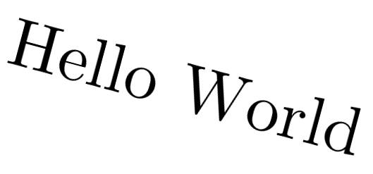

# PS: Printing Text In All Fonts

In this post, we'll leverage ImageMagick to create overlay text in several fonts. This is based on a post by Grant Lipelt (link is down below). Using the images, we'll create a montage as well.

As stated in the original post, creating display-text with any font is straight-forward - just supply the path to the font file. In practice, this works well with `ttf/otf` file-formats. To avoid privilege-issues, we'll supply each of these font-files locally. If you want to use system-fonts, simply look into `C:\Windows\Fonts\` for your desired fonts, and copy them locally.

These create two images with their respective fonts:
```
magick -background white -fill black -font "cmunrb.otf" -pointsize 96 label:"Hello World" -rotate -15 .\cmunrb.png
magick -background white -fill black -font "cmunrm.otf" -pointsize 96 label:"Hello World" -rotate 15 .\cmunrm.png
```

<center></center>

It's easy to see a structure take form. One can easily do this for all these fonts using something like:

```powershell
ls $Fonts | forEach {
    magick -background white -fill black -font "$_" -pointsize 96 label:"Hello World" "$($_.BaseName).png"
}
```

Let's put this into a PowerShell cmdlet:

```powershell
function Out-FontText{
    [cmdletBinding()]
    param(
        [Parameter(Position=0,Mandatory=$True)]
        [string]$Name
    )
    # Copy all system fonts in case none are present
    # Copy-Item C:\Windows\Fonts\* .
    Get-ChildItem *.otf,*.ttf | forEach {
        magick -background white -fill black -font $_.Name -pointsize 96 label:$Name "$($_.BaseName).png"
    }
    # Remove everything except images/script
    # (Get-ChildItem -Exclude *.png,*.ps1) | Remove-Item
    # Create collage of images (480p)
    # magick montage -geometry 640x480 *.png montage.png
}
```

Here, we create overlay-text-images for desired fonts, create a montage, and delete unnecessary files once the entire charade is over.

<center></center>

If you liked this, let me know on my social media. And also take a look at Grant's post to see how he implements an overlay-text-video building up on similar grounds.

# References

- [Flaunt Your Font Want (Grant Lipelt)](https://dragonquest64.blogspot.com/2020/08/flaunt-your-font-want.html)
