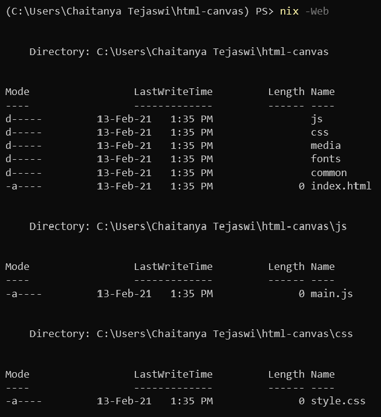

# PS: Custom File-Structures for Projects

Often, when working with projects, you'll need to generate a file-structure. Why not automate this using PowerShell?

The standard way to create new files/directories in PowerShell is through the `New-Item (ni)` cmdlet. Why not customize it to create the whole file-structure for your project?

This example creates file-structure with blank files for a web project & opens them in your favourite editor:
```powershell
<#
.SYNOPSIS
Creates custom project file-structure.
.EXAMPLE
New-ItemX -Web
nix -Web
#>
function New-ItemX{
    [cmdletBinding()]
    [Alias('nix')]
    param(
        [switch]$Web,
        [switch]$Notes,
        [switch]$Python,
        [switch]$PowerShell
    )
    switch ($PSBoundParameters.keys){
        'Web' {
            New-Item -ItemType 'directory' -Path js,css,media,fonts,common
            New-Item -ItemType 'file' -Path index.html,js/main.js,css/style.css
            vim -p index.html js/main.js css/style.css
        }
    }
}
```

<center>
    
</center>

# References

