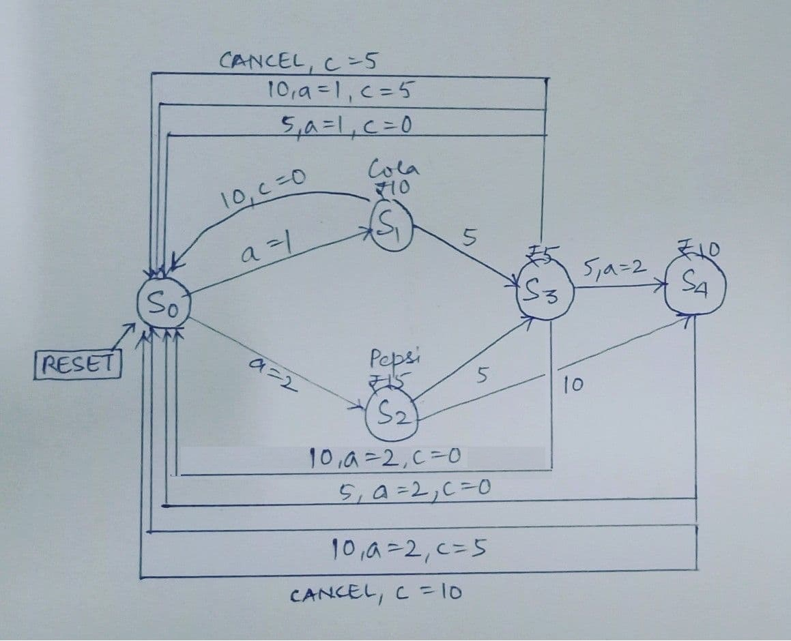
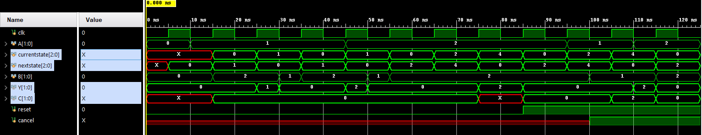

# Verilog: Vending Machine

__Specifications__ <br>

1. Choices: CocaCola (INR 10), Pepsi (INR 15). Each can be selected using their designated button.
2. After making a choice, pay using INR 5,10 notes. Once enough amount is entered, dispense the
product, returning the change, if any. (Note that: In a single turn, you can enter no more
than 1 coin - making the input to be either INR 5,10.)
3. A cancel button can be used to cancel the transaction if partial deposit is made.
4. A reset button resets the machine.

<center></center>

```verilog
// vm.v
/*
 a : select drink (CocaCola/Pepsi: 01/10)
 b : enter money (Rs 5/10: 01/10)
 y : dispense drink (CocaCola/Pepsi: 01/10)
 c : return change (Rs 0/5/10: 00/01/10)
*/
`timescale 1ns/1ns
module VM(
    input [1:0] a,b,
    input clk,
    input reset,
    input cancel,
    output [0:1] y,c);
    reg [2:0] currentstate, nextstate;

    // States
    parameter s0 = 3'b000;  // Reset, Rs.0
    parameter s1 = 3'b001;  // CocaCola (Rs.10)
    parameter s2 = 3'b010;  // Pepsi    (Rs.15)
    parameter s3 = 3'b011;  // Rs.5
    parameter s4 = 3'b100;  // Rs.10

    always @(posedge clk) begin
        currentstate <= nextstate ;

        //while (!reset) begin
        case (nextstate)

           s0:
               if(a==2'b01)             nextstate <=s1;
               else if(a==2'b10)        nextstate <=s2;
               else                     nextstate <=s0;

           s1:
               if(b==2'b01)             nextstate <=s3;
               else if(b==2'b10)        nextstate <=s0; // c=0
               else                     nextstate <=s1;

           s2:
               if(b==2'b01)             nextstate <=s3;
          else if(b==2'b10)             nextstate <=s4;
          else                          nextstate <=s2;

           s3:
               if(cancel)               nextstate <=s0; // c=5
          else if(a==2'b01 & b==2'b01)  nextstate <=s0; // c=0
          else if(a==2'b01 & b==2'b10)  nextstate <=s0; // c=5
          else if(a==2'b10 & b==2'b01)  nextstate <=s4;
          else if(a==2'b10 & b==2'b10)  nextstate <=s0; // c=0
               else                     nextstate <=s3;

           s4:
               if(cancel)               nextstate <=s0; // c=10
          else if(b==2'b01)             nextstate <=s0; // c=0
          else if(b==2'b10)             nextstate <=s0; // c=5
               else                     nextstate <=s4;
               
           default:                     nextstate <=s0;
       endcase
       end
       // Manual Reset
       //assign reset = !reset;
       //nextstate <=s0;
       //end
       
       // Dispense drink/change
       assign y = (currentstate == s1 & b == 2'b10)?a :
                  (currentstate == s3 & a == 2'b01 & b == 2'b01)?a :
                  (currentstate == s3 & a == 2'b01 & b == 2'b10)?a :
                  (currentstate == s3 & a == 2'b10 & b == 2'b10)?a :
                  (currentstate == s4 & a == 2'b10 & b == 2'b01)?a :
                  (currentstate == s4 & a == 2'b10 & b == 2'b10)?a :
                  2'b00;
              
       assign c = (currentstate == s3 & cancel)?2'b01 :
                  (currentstate == s4 & cancel)?2'b10 :
                  (currentstate == s3 & a == 2'b01 & b == 2'b10)?2'b01 :
                  (currentstate == s4 & a == 2'b10 & b == 2'b10)?2'b01 :
                  2'b00;

 endmodule

// test.v

`timescale 1ns/1ns
module test_VM();
    reg [1:0] A,B;
    reg clk;
    wire [1:0] Y,C;
    reg reset, cancel;
    VM VM0(.a(A), .b(B), .clk(clk), .y(Y), .c(C), .reset(reset), .cancel(cancel));
    initial begin
        clk=0;
        forever #5 clk=~clk;
    end
    initial begin
       A=2'b00; B=2'b00; reset=0;
       // Select Cocacola, Pay 10. Change=0
       #10 A=2'b01; #5 B=2'b10;
       
       // Select Cocacola, Pay 5,10. Change=5
       #10 A=2'b01; #5 B=2'b01; #5 B=2'b10;
      
       // Select Pepsi, Pay 5,10. Change=10
       #10 A=2'b10; #5 B=2'b01; #5 B=2'b10;
       
       // Select Pepsi, Pay 10,10. Change=5
       #10 A=2'b10; #5 B=2'b10; #5 B=2'b10;
       
       // Reset.
       #10 reset=1;

       // Select Cocacola, Pay 5, cancel. Change=5
       #10 A=2'b01; #5 B=2'b01; cancel=1;
      
       // Select Pepsi, Pay 10, cancel. Change=10
       #10 A=2'b10; #5 B=2'b10; cancel=1;

       #10 $finish;
   end
 endmodule
```

<center></center>
